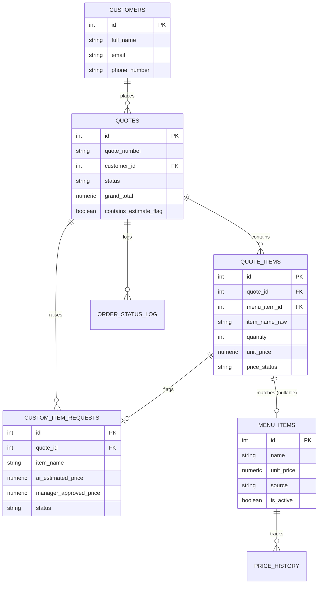

# Database

Two options are documented here. Pick **one** — don't run both.

| | Best if... |
|---|---|
| [PostgreSQL](#postgresql-recommended) | You want real SQL, easy local development, and it to look like a proper backend on your CV. |
| [Firebase](#firebase-alternative) | You want zero server to manage and free hosting for the database itself. |

For a portfolio project that a future employer might look at, **Postgres is the stronger choice** — it shows you can design a relational schema, write constraints, and reason about data integrity, which is a more transferable skill than a NoSQL document store.

## PostgreSQL (recommended)

`schema.sql` is the full schema. To run it locally:

```bash
# macOS: brew install postgresql / Linux: apt install postgresql
createdb reslife_quotes
psql reslife_quotes -f schema.sql
```

Or run Postgres in Docker (no local install needed):

```bash
docker run --name reslife-db -e POSTGRES_PASSWORD=devpassword \
  -e POSTGRES_DB=reslife_quotes -p 5432:5432 -d postgres:16
psql -h localhost -U postgres -d reslife_quotes -f schema.sql
```

n8n connects to this with its built-in **Postgres node** (see `/n8n-workflows`).

### Entity relationship diagram



### How the "unknown item" problem is solved here

This is the part that broke in the Botpress/AutoCrat prototype. The schema is built so the workflow (see `/n8n-workflows`) never has to stop and wait on a human before it can respond to the customer:

1. Customer asks for something not in `menu_items` (fuzzy match fails).
2. A `quote_items` row is created with `menu_item_id = NULL`, `is_custom = TRUE`, `price_status = 'estimated_placeholder'`.
3. A `custom_item_requests` row is created holding the AI's estimated Cape Town market price and *why* it thinks that (`ai_estimate_source`), so the manager can sanity-check the reasoning, not just the number.
4. The quote still goes out to the customer immediately, clearly marked as an estimate (matches the "**Final pricing is subject to manager approval**" note already on your prototype PDF).
5. `quotes.status` becomes `pending_manager_review` and `contains_estimate_flag = TRUE`.
6. When the manager approves a price (with their own markup), that:
   - updates `custom_item_requests.status = 'approved'`
   - **upserts** a new row into `menu_items` with `source = 'manager_confirmed'` — so the next customer who asks for the same item gets an instant, confirmed price. This is what actually grows your catalogue over time instead of you manually maintaining a spreadsheet.
   - updates the `quote_items.unit_price` and recalculates `quotes.grand_total`
   - logs the change in `price_history`
   - triggers the finalised PDF to be regenerated and sent

## Firebase alternative

If you'd rather not run a server at all, here's the equivalent structure as Firestore collections. Document IDs are auto-generated unless noted.

```
customers/{customerId}
  fullName, email, phoneNumber, companyName, billingAddress, createdAt

menuItems/{menuItemId}
  name, category, unitPrice, unit, markupPercent, source, isActive, createdAt

quotes/{quoteId}
  quoteNumber, customerId, eventDate, eventTime, deliveryLocation,
  status, subtotal, grandTotal, containsEstimateFlag, createdAt, sentAt

  quotes/{quoteId}/items/{itemId}      <- subcollection
    menuItemId (nullable), itemNameRaw, quantity, unitPrice, lineTotal,
    isCustom, priceStatus

customItemRequests/{requestId}
  quoteId, quoteItemId, itemName, aiEstimatedPrice, aiEstimateSource,
  managerApprovedPrice, status, resolvedBy, createdAt, resolvedAt
```

Trade-offs vs Postgres:
- ✅ Free tier is generous, no server/hosting to manage, real-time listeners are nice for a live manager dashboard.
- ❌ No foreign keys or CHECK constraints — all validation has to live in your n8n workflow or Cloud Functions instead of the database itself.
- ❌ Aggregate queries (e.g. "total quoted this month") are more awkward than plain SQL.

n8n has a community Firestore node, or you can call the Firestore REST API directly with the HTTP Request node.

## MySQL notes

If you'd rather use MySQL/MariaDB instead of Postgres: replace `SERIAL` with `INT AUTO_INCREMENT`, `NUMERIC` with `DECIMAL`, `TIMESTAMPTZ` with `DATETIME`, and drop the `CREATE VIEW ... mermaid` isn't affected. Everything else is standard SQL and works unchanged.
