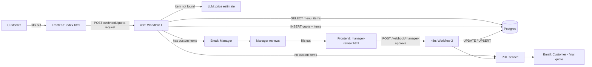

# Architecture

## Why this rebuild happened

The first version (Botpress → Make.com → Google Sheets → AutoCrat) proved the
concept but had two real limits:

1. **No catalogue database.** Menu items and prices were hard-coded into the
   chatbot's conversation flow. Anything the customer asked for outside that
   fixed list couldn't be priced at all.
2. **AutoCrat was slow and fragile** for turning captured data into a PDF —
   a mail-merge tool bent into doing a job a proper templating/PDF service
   does far better.

This version keeps the same core idea (chat-style intake → automatic
quote → manager confirms anything unusual) but replaces each weak link with
a tool suited to it.

## System diagram

## Component choices and why

| Old | New | Why |
|---|---|---|
| Botpress conversation flow (hard-coded prices) | Static HTML form + Postgres catalogue lookup | The form is simpler to build/host/maintain than a chatbot flow, and prices now live in a real database instead of being wired into conversation logic. |
| Make.com | n8n | Same visual-workflow idea, but free/self-hostable and not tied to a per-task pricing plan — matters for a project you want to keep running after the assignment ends. |
| Google Sheets as "database" | Postgres (or Firebase) | Real constraints (foreign keys, uniqueness, checks) instead of hoping nobody breaks a formula in a shared sheet. |
| AutoCrat | HTML template + headless-Chromium PDF service (Gotenberg) | An HTTP call instead of a Google Workspace add-on; much faster, and the template lives in your own repo instead of a Google Doc. |
| Manual owner check on every quote | AI price estimate + `pending_manager_review` status, only for genuinely new items | Matches your original prototype's own disclaimer ("final pricing is subject to manager approval") but now only blocks on items that actually need a human, not every order. |

## The custom-item pricing flow, in detail

This was the specific technical gap identified in the individual assignment
(see the completed answer sheet). Walking through it end to end:

1. Customer orders "Boerewors Roll ×40" — not in `menu_items`.
2. `Match Items & Flag Custom` (a Code node in Workflow 1) fuzzy-matches
   the name against the catalogue and fails to find a good match →
   `is_custom = true`.
3. `AI Estimate Cape Town Price` asks an LLM for a realistic ZAR price for
   that item based on the Cape Town catering market, plus a one-line
   justification (`ai_estimate_source`) — this is stored, not hidden, so a
   manager can sanity-check the *reasoning*, not just trust a number.
4. The quote is created immediately with `price_status = 'estimated_placeholder'`
   on that line, and the PDF/email to the customer clearly marks it as an
   estimate — exactly like the "**Final pricing is subject to manager
   approval**" line already on the RES-26-001 prototype quote.
5. The manager gets an email with the AI's estimate and a link to
   `manager-review.html`. They can accept it, adjust it, and set a markup
   percentage.
6. On approval, the item is **upserted into `menu_items`** with
   `source = 'manager_confirmed'` — it's now a normal catalogue item. The
   next customer who orders a Boerewors Roll gets an instant, confirmed
   price at step 2, no AI estimate or manager step needed.
7. The quote's total is recalculated and the final PDF is sent.

This is the mechanism that makes the catalogue grow on its own instead of
someone manually maintaining a spreadsheet of every item ResLife Foods has
ever sold.

## What's still a placeholder / needs real engineering before production

Being upfront about this matters for both the assignment (MVI Technical Gap
framing) and for anyone reviewing this on GitHub:

- The AI price estimate is a starting point, not a guarantee — it should be
  treated as a *suggestion* the manager checks, not an auto-approved price
  for anything above a sensible value threshold.
- `manager-review.html` has no authentication. Before real use, add a login
  step so only the manager can approve prices.
- Fuzzy item matching in `Match Items & Flag Custom` is a simple
  token-overlap heuristic — good enough for a student project, but a
  production version would want a proper matching library or embeddings-based
  similarity search.
- WhatsApp delivery (mentioned in the original brief) isn't wired up yet —
  the design supports it: add a WhatsApp Business API node in n8n alongside
  the existing email nodes, using the same quote data.
